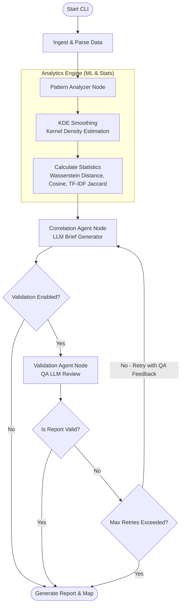

# BoreSight


[](https://www.gnu.org/licenses/gpl-3.0)
[](#platform-support)


BoreSight helps you figure out if two (or more) seemingly unrelated anonymous accounts are actually being run by the exact same person behind the keyboard.

**Sample output:**


BoreSight is a forensic CLI tool designed to perform passive time-series correlation and behavioral alignment across distinct public timestamp datasets. It identifies overlapping patterns such as active/inactive cycles to aid in forensic intelligence gathering and analysis.

> **Why "BoreSight"?**
> In the physical world, boresighting is the process of aligning a weapon's optical sight with the barrel (the bore) of the gun. You are making sure the sight and the barrel are perfectly parallel so that you hit exactly what you are looking at. It is an exercise in precision alignment.
> Similarly, this tool aligns distinct behavioral datasets to find a precise match.

## Features
- **Asynchronous Network Engine**: Thread-safe proxy rotation and dynamic User-Agent injection for resilient dataset fetching.
- **Temporal Correlation Engine**: High-performance temporal aggregation using Pandas, reducing raw timestamps into 24-hour behavioral profiles. Uses **Machine Learning techniques** like **Kernel Density Estimation (KDE)** to smooth sparse data and **Earth Mover's (Wasserstein) Distance** to accurately align slightly shifted schedules. Also calculates statistical variance, Cosine similarity, and Continuous TF-IDF Jaccard coefficients.
- **Bulk Persona Clustering (1-to-Many)**: Supply a target dataset and compare it against an entire directory of datasets to automatically identify the most likely aliases based on their Wasserstein distance leaderboard.
- **Agent Orchestration**: Deterministic analysis workflows powered by LangGraph and LLMs to generate structured forensic intelligence briefs, including estimates for user timezone and geographic location.

## Agentic Workflow (LangGraph)
BoreSight utilizes a deterministic state machine built on **LangGraph** to ingest, process, and validate forensic reports. An optional validation loop uses LLM reflection to verify statistical claims before finalizing the brief.

<details>
<summary><b>Click to expand Agentic Workflow Diagram</b></summary>



</details>

## Installation
Ensure you have Python 3.10 or higher installed.

```bash
# Clone the repository
git clone <repository_url>
cd BoreSight

# Create and activate a virtual environment
python -m venv .venv
source .venv/bin/activate  # On Windows use `.venv\Scripts\activate`

# Install the tool in editable mode
pip install -e .
```

## Usage
BoreSight provides a straightforward CLI. Because we installed it as a package, you can run it directly from anywhere using the `boresight` command (instead of `python main.py`):

```bash
boresight --dataset-a "sample_data/mock_a.json" --dataset-b "sample_data/mock_b.json" --proxies "proxies.txt"
```

### Testing with Mock Data
You can easily test the correlation engine by generating simulated user activity logs. Run the included mock data script:

```bash
python scripts/generate_mock_data.py
```

This will create three datasets inside the `sample_data/` directory.

- **High-Correlation Test (Identical Timezones):**
  `boresight --dataset-a sample_data/mock_a.json --dataset-b sample_data/mock_b.json`
- **Low-Correlation Test (Mismatched Timezones):**
  `boresight --dataset-a sample_data/mock_a.json --dataset-b sample_data/mock_c.json`

### Flags
- `--dataset-a`: Path or URL to the primary dataset.
- `--dataset-b` (Optional): Path or URL to the secondary dataset for 1-to-1 correlation.
- `--dataset-dir` (Optional): Path to a directory of dataset JSONs for 1-to-Many bulk correlation. BoreSight will score all of them and run the LLM graph on the best match.
- `--proxies` (Optional): Path to a text file containing proxy endpoints (one per line).
- `--validate / --no-validate` (Optional): Enable or disable self-validation of the generated brief (overrides `VALIDATION_ENABLED`).
- `--validation-retries` (Optional): Maximum number of validation retries (overrides `VALIDATION_MAX_RETRIES`).
- `--validator-provider` (Optional): LLM provider for validation (overrides `VALIDATOR_PROVIDER`).
- `--validator-model` (Optional): LLM model for validation (overrides `VALIDATOR_MODEL`).

> [!IMPORTANT]
> **OpSec & Rate Limiting Warning:**
> When fetching datasets from remote URLs, it is highly recommended to use the `--proxies` flag. Directly querying web servers or APIs from your personal IP address exposes your identity (origin IP) and increases the likelihood of encountering rate-limits or temporary/permanent IP bans.

## Ecosystem Pipeline (OSINT Integration)

While footprinting tools like [Blackbird](https://github.com/p1ngul1n0/blackbird) are excellent for enumerating *where* a target has accounts, **BoreSight** requires the actual behavioral timestamps to perform correlation. 

We provide adapter scripts in the `scripts/` directory to help bridge this gap. Included adapters:
- **GitHub**: Scrapes public events.
- **Reddit**: Scrapes user comments via the public unauthenticated API.
- **HackerNews**: Scrapes user activity via Algolia's public search API.
- **DEV.to**: Scrapes published articles from Forem/DEV.to APIs.
- **Wikipedia**: Extracts edit timestamps using the MediaWiki API.
- **GitLab**: Resolves user IDs to extract public events.
- **Twitter(X)**: Requires an API Bearer token for fetching tweet timestamps via the v2 API.

For example, to scrape a user's GitHub activity into a BoreSight-compatible dataset:

```bash
# Scrape public GitHub events into a dataset
python scripts/github_adapter.py --username torvalds --output dataset_a.json
```

## Environment Variables
BoreSight supports multiple LLM providers for its correlation agent. You can configure the provider using the `LLM_PROVIDER` variable (defaults to `openai`).

### Generic AI Settings
- `LLM_PROVIDER`: Set to `openai`, `gemini`, `anthropic` (or `claude`), or `ollama`.
- `LLM_MODEL`: Overrides the default model for the chosen provider (e.g., `gpt-4o`, `gemini-1.5-flash`, `claude-3-5-sonnet-20240620`, `llama3`).

### Validation & Reflection Settings (Optional)
BoreSight supports an optional validation and reflection loop to self-verify generated briefs using a validator LLM.
- `VALIDATION_ENABLED`: Set to `true` to enable self-validation (defaults to `false`).
- `VALIDATION_MAX_RETRIES`: The maximum number of correction attempts if validation fails (defaults to `3`).
- `VALIDATOR_PROVIDER`: LLM provider for the validation step (defaults to the value of `LLM_PROVIDER`).
- `VALIDATOR_MODEL`: Specific model to use for validation (e.g., `gpt-4o` or `claude-3-5-sonnet-20240620`). We recommend using a highly capable model for best results.

### Provider-Specific Keys
- `OPENAI_API_KEY`: Required if `LLM_PROVIDER=openai`.
- `GOOGLE_API_KEY`: Required if `LLM_PROVIDER=gemini`.
- `ANTHROPIC_API_KEY`: Required if `LLM_PROVIDER=anthropic` or `LLM_PROVIDER=claude`.
- `OLLAMA_BASE_URL`: Optional for Ollama (defaults to `http://localhost:11434`).

## Contributing

Contributions are welcome! Please feel free to submit a pull request.

## License

This project is licensed under the GNU General Public License v3.0. See the `LICENSE` file for details.

### ⚠️ Disclaimer

```
BoreSight is intended strictly for educational, research, and authorized defensive security optimization purposes. 

The usual disclaimers apply: the author of BoreSight is entirely exempt from liability for any damages, service disruptions, or privacy complications resulting directly or indirectly from the functional execution of this program. The developer bears NO responsibility for the specific target context or any subsequent misuse of these scripts. 

By executing this software, you explicitly acknowledge and accept that any resulting system crashes, data loss, network throttling, or platform account suspensions are solely your responsibility.
```

[](https://ko-fi.com/I3I81RWCLP)
